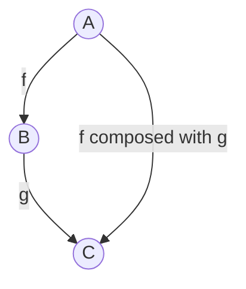

# Chapter 1
## Notes Gernot
### Definition
* definition of a category: objects and arrows that go between them
* essence of a category: composition (arrows compose)
* arrows = morphisms can also be seen as functions
* composition of function f : A -> B and g. B -> C into a new function
A -> C
* notation: g (circle) f
or in Pseudo Code
(g (f x)) (in Clojure there is the comp function)

### Properties of composition
* Associativity (h ◦ g) f = h ◦ (g ◦ f)
####  Exististence of composition unit
* for every object A there is an arrow that loops to itself 
* being a unit of composition: when it is composed with any other arrow that either starts or ends at A, it is still the same arrow
* unit arrow is called $id_{A}$
* if f goes from A to B then $f \circ id_{A} = f$ and $id_{B} \circ f = f$
* arrows are morphisms
### Composition is the Essence of programming
* dividing bigger problems into smaller problems
* writing code to solve the smaller problems
* compose the code for solving the smaller problems to solve the bigger problem
* decomposition does not make sense if you cannot put the pieces together afterwards
* because our brain can only focus on a limited number of things, we need structure in our code
* what are the right chunks for the composition of programs?
  * "surface area has to grow slower than their volume"
  * surface area: information we need in order to compose chunks
  * volume: information we need in order to implement them
  * OOP: class declaration of the object or its abstract interface
  * FP: declaration of a function
  * Category theory is extreme in the sense that it actively discourages us from looking inside objects
  * OOP: object is only visible through its abstract interface, with methods playing the role of arrows
  
### Challenges

Challenge 1-3

```clojure
(ns test-clojure-date.devhaus
  (:require
   [clojure.string :as str]))

(defn my-id [sth]
  sth)

(defn my-comp [f g]
  (fn [& args] (f (apply g args))))

(def my-composed-fn (my-comp str/upper-case #(str % " hello!")))

(my-composed-fn "here is something")

;; is id preserved?
(=
 (inc 2)
 ((my-comp inc my-id) 2))
```

4
* associativity: yes
* id: link to self -> does not always exist
-> no category

5
* one is not automatically befriended to oneself
* arrows do not compose (if A is friend to B and B is friend to C, A is not friend to C)

6

* when there is an edge for each node that goes to the same node
* when for all nodes the following holds: if there is an edge from node A to node B and there is an edge from node B to node c  then there is an edge from node A tp node C
