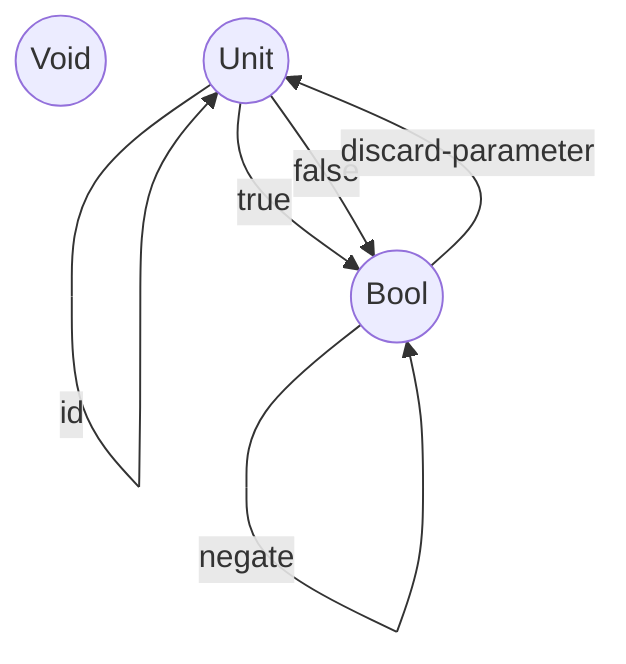

# Notes Gernot
## Who needs types?
* Thought experiment: random bytes produced by monkey using typewriters
  * machine language: any combination of bytes would be accepted
  * higher level languages: lexical and grammatical errors can be detected before
  * types: introduce another barrier against nonsensical programs
    * statically typed languages: type errors are caught at compile time
    * dynamically typed languages: type errors are caught at runtime
## Types are about Composability
* Category Theory: composing arrows - target object of the one arrow has to be the source object of the other arrow
* in programming: result of one function is passed to another function
* the stronger the type system, the better this match can be described and mechanically verified
* arguments against strong static type checking
  * might eliminate programs, that are semantically correct
  * imposes too much burden on the programmer (counter argument: use type inference)
* in Haskell: common approach to start with the type definitions
* strong static typing is often used as an excuse for not testing the code (if it compiles, then it must be correct)
  * does not necessarily result in better code quality
* vice versa: unit testing is not a replacement for types
## What are Types?
* simplest intuition: sets of values (e.g. type Bool is a set of two values: True and False, Char is a set of all Unicode Characters..)
  * sets can be finite or infinite (example of an infinite set: String)
  * problems: polymorphic functions that involve circular definitions and the fact that you can't have a set of all sets
* Category of sets: Set
  * Objects are sets, arrows (morphisms) are functions
  * Set Category is special: we can peek inside the objects (e.g. an empty set has no elements)
    * there are special one element sets
    * functions map elements from one set to elements of another set
    * they can map two elements to one, but not one element to two
    * identity functions maps every element to itself
* in an ideal world: Haskell types are sets and Haskell functions are mathematical functions between them
  * problem: computation takes place, which might involve recursion or might not terminate
  * solution: bottom type (indicating, that it does not terminate) - $\bot$
  * treat every runtime error as $\bot$  (in Haskell: undefined)
  * functions that may return bottom are called partial (as opposed to total functions, which return valid results
  for every possible argument)
## Why do we need a mathematical model?
* syntax and grammar of a programming language is usually described using formal notation at the very beginning of the language spec
* meaning/semantics is much harder to describe
  * formal tools for describing semantics: operational semantic
  * semantics of industrial languages like C++ are is usually described using an abstract machine
  * problem: hard to prove things about programs using operational semantics (you have to "run" it through the idealized interpreter)
* denotational semantics
  * based on math
  * every programming construct is given its mathematical interpretation
  * if you want to prove a property of a program, you prove a mathematical theorem
  * question: what is the mathematical model for reading a character from the keyboard?
    * -> computational effects can be mapped to monads!
* having a mathematical model allows for formal proofs of software
## Pure and Dirty Functions
* mathematical function: mapping of values to values
* function having no side effects (e.g. computation of square root) can be easily modelled as a mathematical function
* in a purely functional programming language like Haskell: all functions are pure -> easier to give them denotational semantics and model them using category theory
* for other languages: always possible to restrict yourself to a pure subset
* monads let us model all kind of affects using only pure functions
## Examples of types
* exotic types: empty set (not inhabited by any values)
    * in Haskell: void
    * Void -> a : polymorphic function in its return type, can never be called
    * Void represents falsity
    * in C++ there is no such type "no type"
  * type that represents a singleton sets, has only one value
    * just value
    * in C++: void
    * in Haskell: () (Unit)
    * function int () {return 44}; : Unit -> Int
      ```mermaid
        graph TD
        a(("{Unit}")) -->b((Int))
      ```
      * every call of the function is a different way of picking one element from the target type (in this case 44)
      * -> call of the function is a different way of describing the element 44 from the int type
      * pure functions that return Unit (or Void) discard their argument (as they are not allowed to have side effects)
    * unit: A -> Void
    * unit x = ()
      * maps every element of A to the element "Void" of the single set
      * implementation does not depend on the type of the argument -> "parametrically polymorphic"
    ```mermaid
      graph TD
          a((String)) -->b(("{Unit}"))
          c((Integer)) -->b(("{Unit}"))
          d((Float)) -->b(("{Unit}"))
    ```
  * two-element set: $Bool = {True, False}$
  * functions to Bool are called predicates
## Challenges
### 1


```clojure

;; a verbose memoization function

(defn memoize-my-fun
  "Returns a new version of f that caches results based on arguments. f has to be pure."
  [f]
  (let [my-cache (atom {})
        compute-result-and-update-cache-content (fn [cache-content args]
                                                  (let [result (apply f args)]
                                                    (assoc cache-content args result)))]
    (fn [& args] (if-let [cached-result (get @my-cache args)]
                   (do
                     (println "Found result in cache for args " args)
                     cached-result)
                   (do
                     (println "Nothing in cache -> Computing " (str f " " args))
                     (swap! my-cache compute-result-and-update-cache-content args)
                     (get @my-cache args))))))

;; for comparison: this is the memoize function from clojure.core - https://github.com/clojure/clojure/blob/master/src/clj/clojure/core.clj#L6387

```

### 2

```clojure

(def my-memoized-rand (memoize-my-fun rand))


lein-test-app.core> (my-memoized-rand)
Nothing in cache -> Computing  clojure.core$rand@292488e7 
0.869602122274886
lein-test-app.core> (my-memoized-rand)
Found result in cache for args  nil
0.869602122274886

```

-> works, value is cached :-)

of course, the it is not random anymore

### 3
TODO

### 4

a) is pure
b) not pure, has side effects and will return different results
c) not pure, has side effects (printing to screen)
d) not pure, static y is initialized with 0 but then changed -> will return different results

### 5

* true -> true
* false -> false

(this is one function "id")

* true -> false
* false -> true

(this is one function "negate")

-> in total these  2 functions would be sufficient to implement all possible mappings

* in Category Theory, this would be 2 morphisms

* in a programming language, there are an endless number of functions implementing these mapping

### 6



