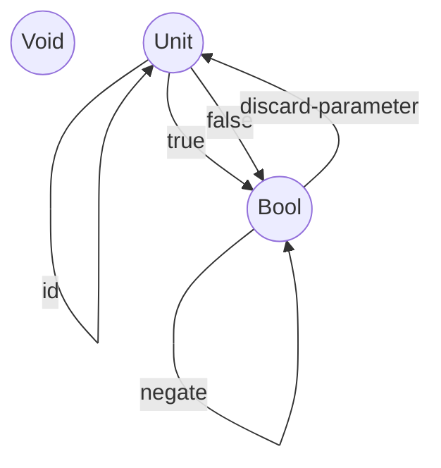

## Challenges
### 1


```clojure

;; a verbose memoization function

(defn memoize-my-fun
  "Returns a new version of f that caches results based on arguments. f has to be pure."
  [f]
  (let [my-cache (atom {})
        compute-result-and-update-cache-content (fn [cache-content args]
                                                  (let [result (apply f args)]
                                                    (assoc cache-content args result)))]
    (fn [& args] (if-let [cached-result (get @my-cache args)]
                   (do
                     (println "Found result in cache for args " args)
                     cached-result)
                   (do
                     (println "Nothing in cache -> Computing " (str f " " args))
                     (swap! my-cache compute-result-and-update-cache-content args)
                     (get @my-cache args))))))

;; for comparison: this is the memoize function from clojure.core - https://github.com/clojure/clojure/blob/master/src/clj/clojure/core.clj#L6387

```

### 2

```clojure

(def my-memoized-rand (memoize-my-fun rand))


lein-test-app.core> (my-memoized-rand)
Nothing in cache -> Computing  clojure.core$rand@292488e7 
0.869602122274886
lein-test-app.core> (my-memoized-rand)
Found result in cache for args  nil
0.869602122274886

```

-> works, value is cached :-)

of course, the it is not random anymore

### 3
TODO

### 4

a) is pure
b) not pure, has side effects and will return different results
c) not pure, has side effects (printing to screen)
d) not pure, static y is initialized with 0 but then changed -> will return different results

### 5

* true -> true
* false -> false

(this is one function "id")

* true -> false
* false -> true

(this is one function "negate")

-> in total these  2 functions would be sufficient to implement all possible mappings

* in Category Theory, this would be 2 morphisms

* in a programming language, there are an endless number of functions implementing these mapping

### 6

