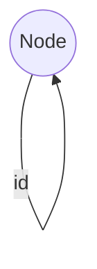
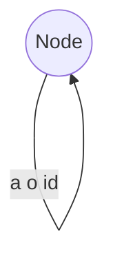
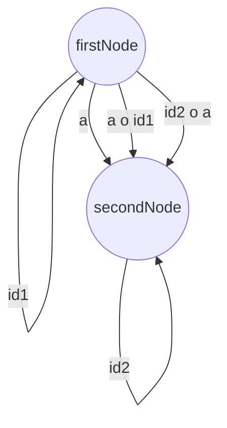

# 1
## a

## b

## c 

## d
will result in infinite arrows (combination of all possibilities for constructing homomorphisms from the single character homorphisms) but they are essentially the same morphism

# 2
## a
* composition works is associative -> preorder
* if A subset B and B subset A -> A = B 
* partial order
* any two objects are in relation with each other -> not neccessarily!

## b

