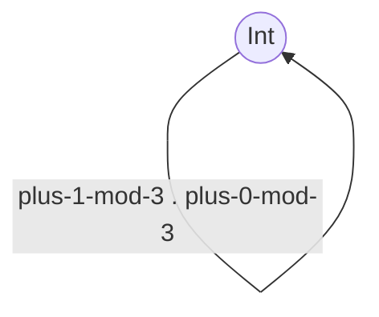

# 1
## a

## b

## c

## d
will result in infinite arrows (combination of all possibilities for constructing homomorphisms from the single character homorphisms) but they are essentially the same morphism

# 2
## a
* composition works
* is associative -> preorder
* if A subset B and B subset A -> A = B
* partial order
* any two objects are in relation with each other -> not neccessarily!

## b
* composition: ok
* associative: ok
-> preorder
* if T1 is a subtype of T2 and T2 is a subtype of T1 -> T1 = T2 ?
-> i guess so
-> any two objects are in relation? -> no
-> partial order

# 3
* Reminder: Definition of a set-Monoid
 * set with a binary operation
 * opration is associative and there is a neutral element
## Set-Theoretical Monoid for Bool with &&
* (a && b) && c = (a && (b && c)) for all a,b,c in Bool -> associative
* neutral element: True
 * True && True = True
 * False && True = False

## Set-Theoretical Monoid for Bool with ||
* (a || b) || c = (a || (b || c)) for all a,b,c in Bool -> associative
* neutral element: False
 * True || False = True
 * False || False = False

# 4
* Single object: Bool (as a set of True and False)
* Morphisms:
  * and-true (= identity function)
  * and-false
* Compositions
  * and-false . and-false = and-false
  * id. and-false = and-false
  * and-false . id = and-false
  * id . id = id

# 5
* addition mod 3 will always result in values 0,1,2
* Single Object: Int which is the set 0,1,2
* Morphisms:
  * plus-0-mod-3 (add 0 and then apply mod 3) <- identity function
  * plus-1-mod-3 (add 1 then apply mod 3)
  * plus-2-mod-3 (add 2 then apply mod 3)
* Compositions
 * id . id = id
 * id . plus-1-mod-3 = plus-1-mod-3
 * plus-1-mod-3 . id = plus-1-mod-3
 * plus-1-mod-3 . plus-1-mod-3 = plus-2-mod-3
 * we can create infinite compositions that follow rules of addition

